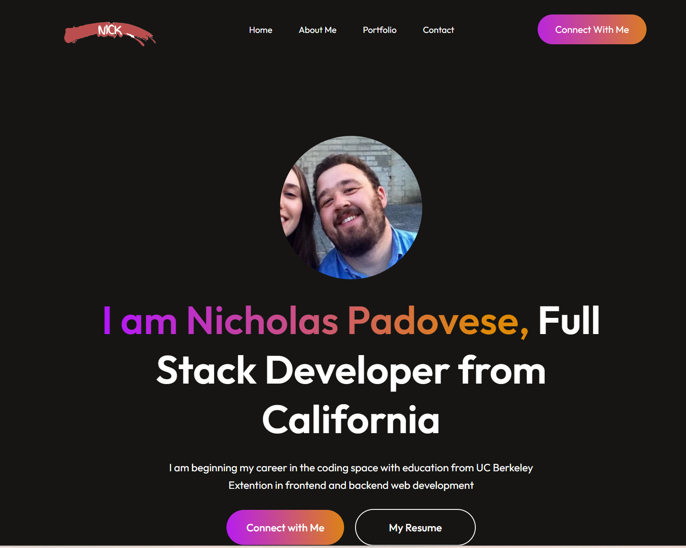
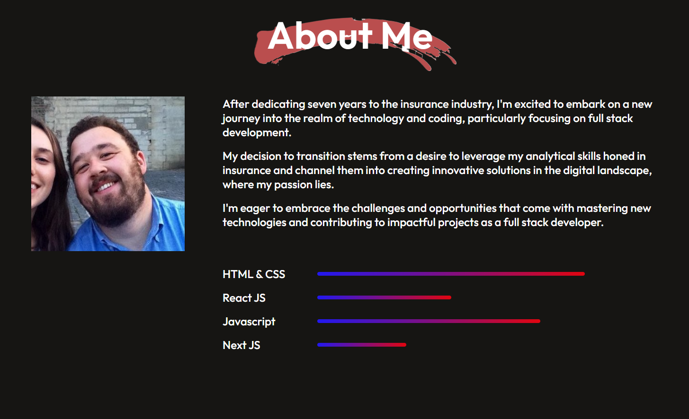
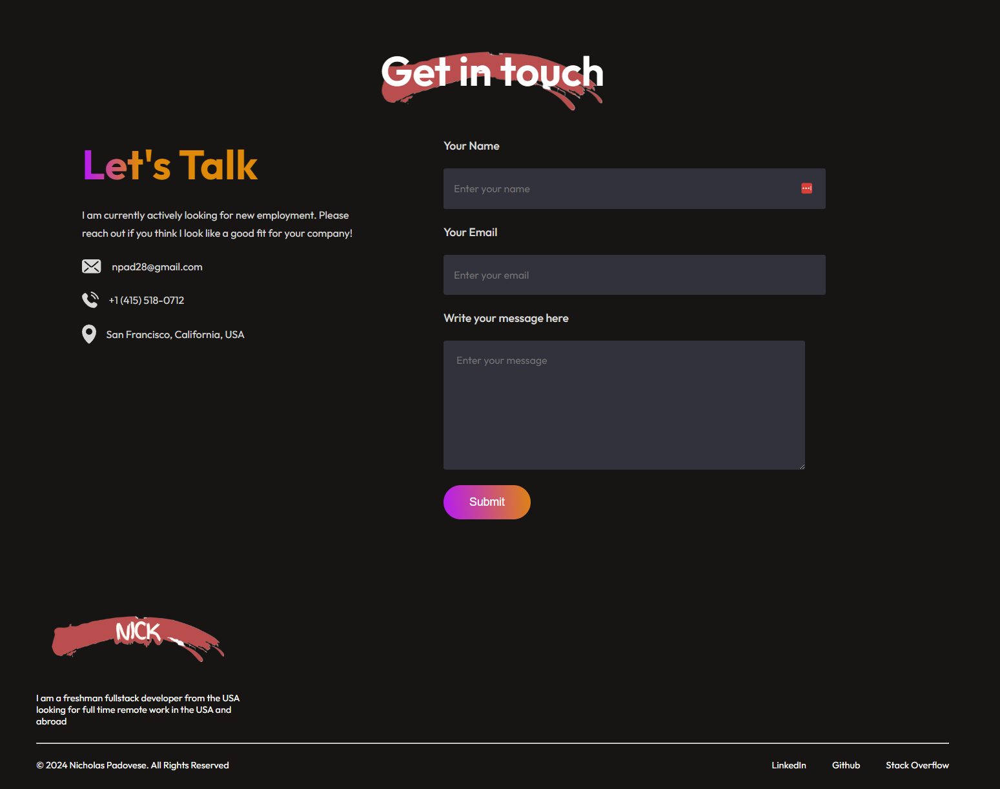

# Nicks-Portfolio
Project Name: Portfolio-project

## Table of Contents
* [Description](#description)
* [Features](#features)
* [Technologies Used](#technologies-used)
* [Usage](#usage)
* [License](#license)
* [Repository](#repository)
* [Screenshots](#screenshots)

## Description:
The Portfolio Showcase project is designed to serve as a comprehensive display of my skills, achievements, and projects. This portfolio is aimed at showcasing my expertise, experience, and creativity in various fields, providing visitors with insights into my capabilities and past work.

## Features:
* Home Page: Introduce myself and provide a brief overview of the portfolio.
* About Me: Detailed information about my background, skills, and experience.
* Portfolio Section: Showcase of my projects, including descriptions, technologies used, and links to live demos or repositories.
* Resume/CV: Downloadable version of my resume or curriculum vitae.
* Contact Form: A way for visitors to get in touch with me for potential opportunities or collaborations.
* Responsive Design: Ensures compatibility and optimal viewing experience across various devices and screen sizes.

## Technologies Used:
* HTML, CSS, JavaScript, React

## Usage:
* Customize the content of the portfolio by editing HTML and CSS files.
* Add your projects to the portfolio section with relevant information.
* Modify the contact form to connect it to your preferred email address or backend service.

## License:
This project is licensed under the MIT License.

## Screenshots:

